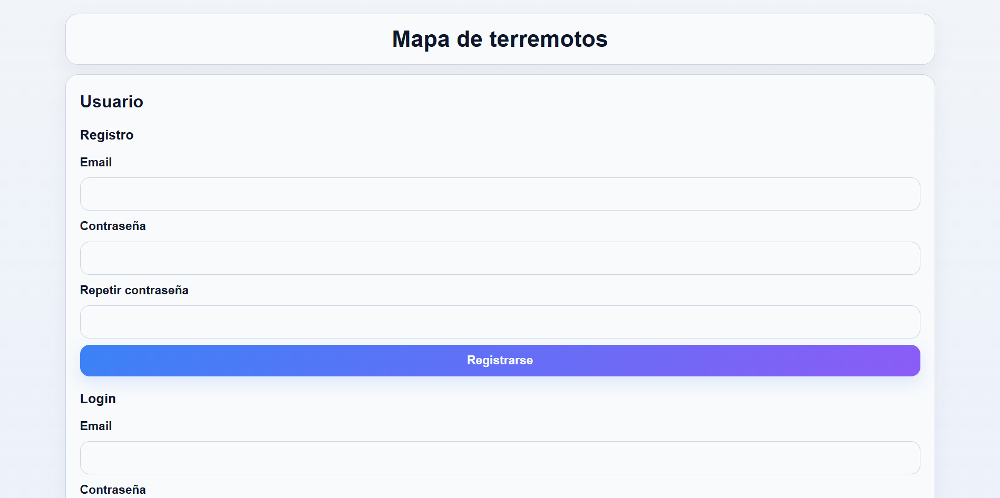
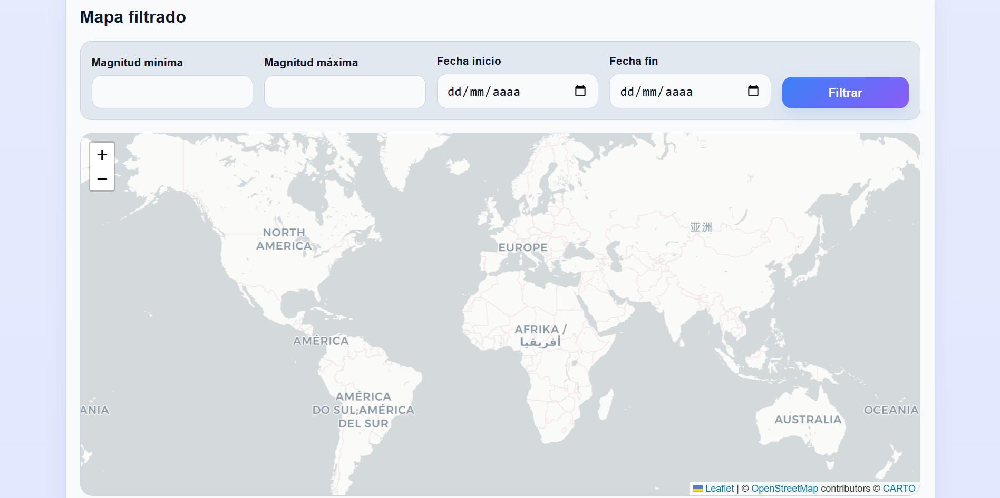

# Web de Terremotos

Aplicación web que muestra terremotos en un mapa interactivo utilizando datos en tiempo real, con posibilidad de filtrado y gestión de favoritos por usuario.

---

## Funcionalidades

### Mapa general
- Visualización de terremotos en tiempo real
- Datos obtenidos desde una API externa (USGS)
- Marcadores personalizados según magnitud
- Popup con información:
  - Título
  - Fecha
  - Ubicación
  - Código
  - Magnitud

### Mapa filtrado
- Filtro por:
  - Magnitud mínima y máxima
  - Fecha de inicio y fin
- Resultados mostrados en un segundo mapa
- Botón dinámico: Filtrar / Limpiar

### Favoritos
- Guardar terremotos como favoritos
- Visualizar favoritos en el mapa
- Eliminar favoritos
- Evita duplicados

### Autenticación
- Registro de usuarios
- Inicio de sesión
- Cierre de sesión
- Solo usuarios autenticados pueden guardar favoritos

---

## Tecnologías utilizadas

- HTML5
- CSS3 (responsive, mobile-first)
- JavaScript (ES6)
- Leaflet (mapas interactivos)
- API Earthquake USGS
- Firebase:
  - Authentication
  - Firestore (base de datos)

---

## API utilizada

Datos obtenidos de la API pública de terremotos:

https://earthquake.usgs.gov/

Formato de datos: GeoJSON

---

## Estructura del proyecto

```
/project
│── index.html
│── styles.css
│── scripts.js
│── README.md
│── assets/

```

---

## Funcionamiento

1. Se realiza una petición a la API de terremotos
2. Se procesan los datos (GeoJSON)
3. Se dibujan los marcadores en el mapa con Leaflet
4. Se permite filtrar los resultados mediante parámetros dinámicos
5. Se gestionan usuarios con Firebase Auth
6. Se guardan los favoritos en Firestore asociados a cada usuario

---

## Gestión de favoritos

- Cada favorito se guarda en Firestore
- Se asocia al usuario mediante `userId`
- Se evita duplicidad mediante ID único: userId + earthquakeId


---

## Diseño

- Responsive (mobile-first)
- Uso de CSS moderno
- Interfaz clara y funcional

---

## Capturas del proyecto


### Página principal




### Mapa




---
## Cómo clonar y ejecutar el proyecto

Sigue estos pasos para obtener una copia del proyecto y ejecutarlo en tu ordenador:

### Clonar el repositorio

Abre una terminal y ejecuta:

```bash
git clone https://github.com/Elegm92/proyecto-terremotos.git
```

Después entra en la carpeta del proyecto:

```bash
cd landin_terremotos
```
---
## Cómo ejecutar el proyecto

1. Descarga o clona el repositorio.
2. Abre la pagina con (https://github.com/Elegm92/proyecto-terremotos.git).
3. Abre el archivo **index.html** en tu navegador.
4. Navega por las diferentes secciones de la página.


---

## Autor

Proyecto realizado por **Elena González** como práctica de desarrollo web.

